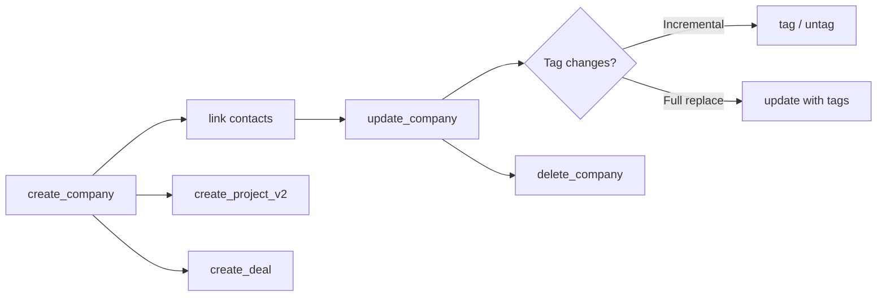

# Companies — Business Logic

## Rules

### Required Fields
- `name` is the only required field for creating a company

### Telephone Types
- Companies only support `phone` and `fax` types (NOT `mobile`)
- Contacts support `phone` and `mobile`

### Tags
- **`tags` on update OVERWRITES all existing tags** — not additive
- Use `tag_company` / `untag_company` for incremental tag changes
- Tags that don't exist yet are auto-created on first use

### Responsible User
- Optional `responsible_user_id` — the account manager for this company
- Nullable: pass `null` to clear

### Email Structure
- Same pattern as contacts: `[{ type: "primary", email: "..." }]`
- Flattened to `email` param in our tool

### VAT Number
- Filterable on list — useful for dedup/lookup
- Free text field, no validation

### Logo Upload
- **Out of scope** — `companies.uploadLogo` is a binary upload endpoint
- Excluded in CLAUDE.md scope decisions (binary uploads skipped)

### Relation to Contacts
- Companies don't "contain" contacts — the link is managed from the contact side
- Use `link_contact_to_company` to associate people
- Use `list_contacts(company_id=...)` to find linked contacts

### Nullable Fields
- `remarks`, `responsible_user_id` accept `null` to clear
- Other string fields cannot be nulled, only overwritten

### Delete
- Irreversible

### Status
- Two states: `active` (default) and `deactivated`
- Filterable on list

## Workflow

## Decisions

| Date | Decision | Reason |
|------|----------|--------|
| 2026-03-03 | No `mobile` phone type | API only supports phone + fax for companies |
| 2026-03-03 | Logo upload out of scope | Binary upload — not worth the complexity for MCP tool |
| 2026-03-05 | Contact linking via contact side only | API design — `contacts.linkToCompany` is the endpoint, not `companies.addContact` |
