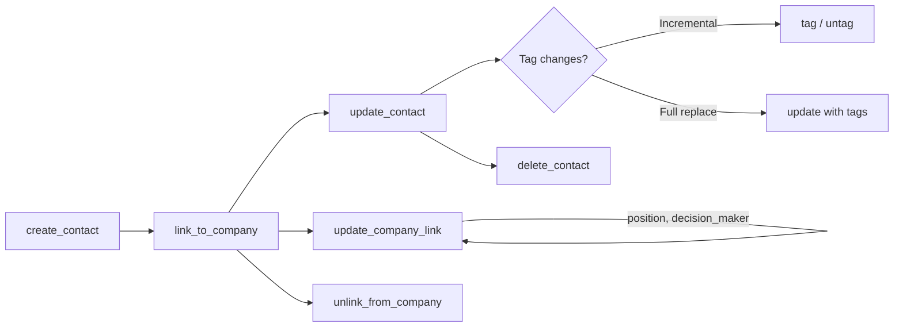

# Contacts — Business Logic

## Rules

### Required Fields
- `last_name` is the only required field for creating a contact
- `first_name` is optional (API allows contacts with only a last name)

### Email & Phone Structure
- Emails are stored as typed array: `[{ type: "primary", email: "..." }]`
- Telephones are typed: `phone` and `mobile` are separate types
- Our tool flattens this: `email`, `phone`, `mobile` as simple string params

### Tags
- **`tags` on update OVERWRITES all existing tags** — not additive
- Use `tag_contact` / `untag_contact` for incremental tag changes
- Tags filter on `list` uses AND logic: contact must have ALL specified tags
- Tags that don't exist yet are auto-created on first use

### Company Linking
- A contact can be linked to **multiple companies**
- Each link has optional metadata: `position` (free text) and `decision_maker` (boolean)
- Three operations: `linkToCompany`, `unlinkFromCompany`, `updateCompanyLink`
- Unlinking does not delete either entity
- `company_id` filter on list returns contacts linked to that specific company

### Status
- Two states: `active` (default) and `deactivated`
- Filterable on list

### List vs Info
- `list` returns flat `primary_address`, NOT the full `addresses[]` array
- Use `get_contact` (info) for full details including all addresses, custom fields, linked companies

### Nullable Fields
- `first_name`, `salutation`, `website`, `remarks` accept `null` to clear the value
- Other string fields cannot be nulled, only overwritten

### Delete
- Irreversible — removes contact and all linked data

## Workflow

## Decisions

| Date | Decision | Reason |
|------|----------|--------|
| 2026-03-03 | Flatten email/phone to simple params | KISS — users don't need array complexity for primary contact info |
| 2026-03-03 | No deduplication logic in tool | API doesn't support it natively; left to user judgment |
| 2026-03-03 | `gender` uses enum with 5 options | Matches API spec: male, female, non_binary, prefers_not_to_say, unknown |
| 2026-03-05 | `tags` overwrite warning in tool description | Critical gotcha — users expect additive behavior by default |
