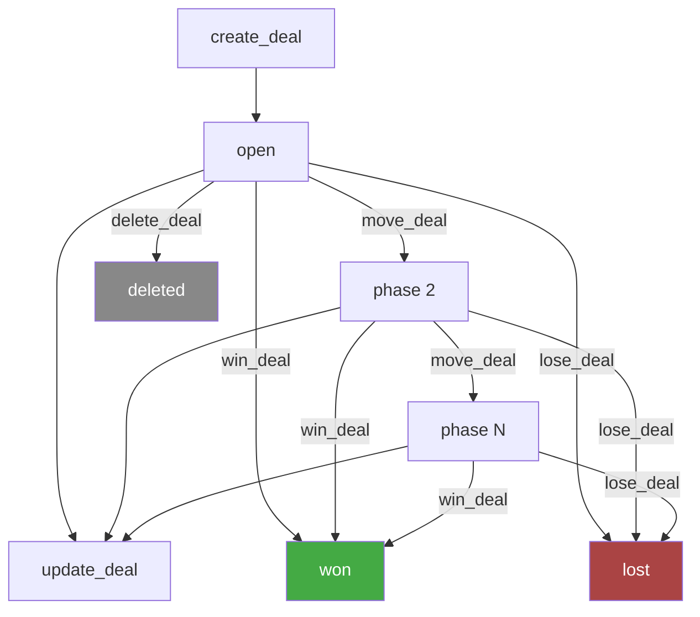
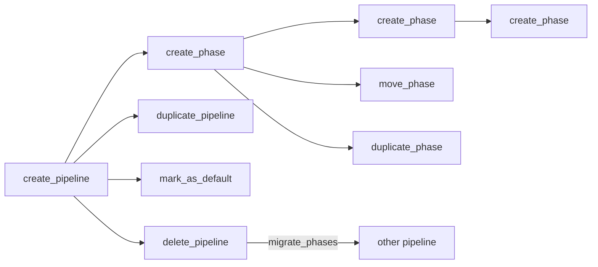

# Deals — Business Logic

## Rules

### Required Fields (Create)
- `title` — deal name
- `customer` — nested object `{ type: "contact"|"company", id }` (tool flattens to `customer_type` + `customer_id`)
- `phase_id` — required in our tool (optional in API, defaults to first phase)

### Pipeline / Phase Model
- **Pipeline**: a sales workflow (e.g., "Sales", "Enterprise")
- **Phase**: a step within a pipeline (e.g., "Qualification", "Proposal", "Negotiation")
- Each deal lives in exactly one phase at a time
- Phases have `requires_attention_after` (amount + unit) — drives notification
- Phases have optional `estimated_probability` (0-1) and `follow_up_actions`

### Pipeline CRUD
- `create` / `update` / `delete` / `duplicate` / `markAsDefault`
- Delete supports `migrate_phases[]` — maps old phase IDs to new phase IDs in another pipeline
- Without migration, deals in deleted phases are orphaned

### Phase CRUD
- `create` / `update` / `delete` / `duplicate` / `move` (reorder within pipeline)
- `requires_attention_after` is **always required** on create and update
- Delete supports optional `new_phase_id` to migrate deals
- `move` places phase after `after_phase_id` (reordering)

### Deal Status Lifecycle
- Three states: `open`, `won`, `lost`
- `open` → `won`: via `win_deal` — **irreversible**
- `open` → `lost`: via `lose_deal` — with optional `reason_id` + `extra_info`
- Status is filterable as array: `["open"]`, `["won", "lost"]`, etc.

### Move vs Update
- **`move_deal`**: changes the phase (pipeline progression)
- **`update_deal`**: changes metadata (title, value, dates, etc.) — does NOT change phase
- These are separate endpoints by design

### Customer Filter (List)
- API expects nested object: `{ customer: { type, id } }`
- Tool flattens to `customer_type` + `customer_id` params — both required together

### Estimated Value
- Nested: `{ amount: number, currency: "EUR" }`
- Both `amount` and `currency` required together

### Nullable Fields on Update
- `summary`, `source_id`, `department_id`, `contact_person_id` accept `null` to clear
- Other fields can only be overwritten

### Lost Reasons
- Predefined list — fetch with `list_lost_reasons`
- Optional when marking deal as lost

### Sources
- Predefined list — fetch with `list_deal_sources`
- Optional on create, nullable on update

### Delete
- Irreversible

## Workflow

### Pipeline Management

## Decisions

| Date | Decision | Reason |
|------|----------|--------|
| 2026-03-03 | `phase_id` required on create | Explicit is better — prevents deals landing in wrong default phase |
| 2026-03-03 | Customer filter flattened to two params | KISS — avoids nested object in tool params |
| 2026-03-03 | Full pipeline/phase CRUD included | Sales teams frequently customize pipelines; essential for deal management |
| 2026-03-03 | `win_deal` takes no extra params | API design — winning is a simple state change, no metadata needed |
| 2026-03-05 | Separate `move_deal` from `update_deal` | API enforces this separation — phase changes are a distinct operation |
