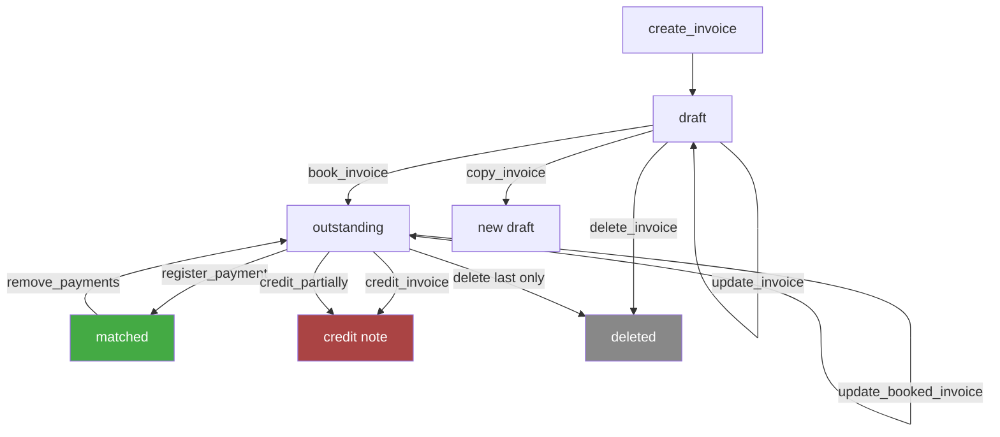

# Invoices — Business Logic

## Rules

### Status Model
- **draft** — created but not finalized, no invoice number yet
- **outstanding** — booked (finalized), awaiting payment
- **matched** — fully paid (NOT called "paid" in API — `matched` is the correct status)
- `booked` and `paid` are **NOT valid API statuses** — using them returns 400

### Required Fields (Create)
- `invoicee.customer` — nested `{ type: "contact"|"company", id }` (tool flattens to `customer_type` + `customer_id`)
- `department_id` — which department issues the invoice
- `payment_term` — `{ type, days? }` (e.g., `after_invoice_date` + 30 days)
- `grouped_lines` — at least one line item group

### Line Items
- Grouped in `grouped_lines[].line_items[]`
- `unit_price.tax` = `"excluding"` — this is a string label, NOT a currency field
- Each item needs: `quantity`, `description`, `unit_price`, `tax_rate_id`
- Optional: `product_id` (links to catalog product)

### Draft vs Booked Update
- **Draft** (`invoices.update`): all fields editable — customer, lines, dates, notes, PO number, project
- **Booked** (`invoices.updateBooked`): limited fields — customer, payment term, date, note, lines, project
- Separate endpoints by API design — cannot use `update` on booked invoices

### Booking
- `invoices.book` transitions draft → outstanding
- Assigns invoice number
- Requires `on` date (booking date)
- **Irreversible** — once booked, cannot unbook

### Delete Rules
- Draft invoices: can always be deleted
- Booked invoices: only the **last booked invoice** can be deleted
- Earlier booked invoices cannot be deleted (use credit note instead)

### Sending
- **Email** (`invoices.send`): requires recipients, subject, body; supports cc/bcc, mail templates, attachments
- **Peppol** (`invoices.sendViaPeppol`): e-invoicing network, only needs invoice ID; customer must have Peppol identifier configured

### Payment Registration
- `invoices.registerPayment` — nested structure:
  ```json
  { "id": "...", "payment": { "amount": 100, "currency": "EUR" }, "paid_at": "2026-03-03T10:00:00+01:00" }
  ```
- Field is `paid_at` (NOT `payment_date`)
- Optional `payment_method_id` (lookup via `paymentMethods.list`)
- `invoices.removePayments` removes ALL payments from an invoice (no partial removal)

### Credit Notes
- **Full credit** (`invoices.credit`): credits all lines, creates credit note
- **Partial credit** (`invoices.creditPartially`): specify which line items to credit
  - Same `grouped_lines` structure as invoice creation
  - `unit_price.tax = "excluding"` — same string label quirk
  - Supports discount per line item (percentage)
- Both return `{ id, type }` of the created credit note

### Copy
- `invoices.copy` creates a new draft from an existing invoice
- Returns new draft ID — modify with `update`, then `book`

### Download
- Formats: `pdf`, `ubl/e-fff`, `ubl/peppol_bis_3`
- Returns temporary URL with expiration

### Filters (List)
- Customer: nested `{ type, id }` — tool flattens to `customer_type` + `customer_id`
- Date range: `invoice_date_after` / `invoice_date_before` (YYYY-MM-DD, inclusive)
- Status: array, e.g. `["draft", "outstanding"]`
- Cross-references: `subscription_id`, `deal_id`, `project_id`
- Search: `term` searches invoice number, PO number, payment reference, invoicee name
- Late fees: pass `includes: "late_fees"` for incasso/interest totals

## Workflow



## Decisions

| Date | Decision | Reason |
|------|----------|--------|
| 2026-03-03 | `paid_at` field name documented prominently | API quirk — `payment_date` does not exist, causes 400 |
| 2026-03-03 | `unit_price.tax = "excluding"` noted on all line items | Non-obvious — looks like it should be a currency field but is a string label |
| 2026-03-03 | Separate tools for draft update vs booked update | API enforces different endpoints with different allowed fields |
| 2026-03-03 | Status values documented as `draft/outstanding/matched` | `paid` and `booked` are NOT valid — common mistake |
| 2026-03-05 | `invoices.send` and `invoices.sendViaPeppol` as separate tools | Different input requirements — email needs recipients/content, Peppol only needs ID |
