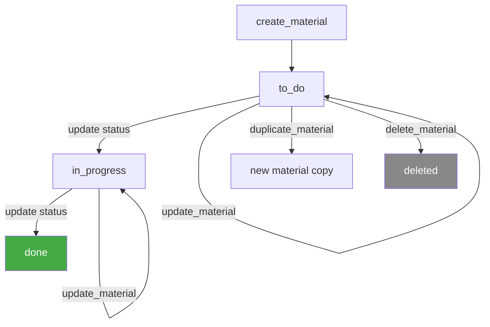
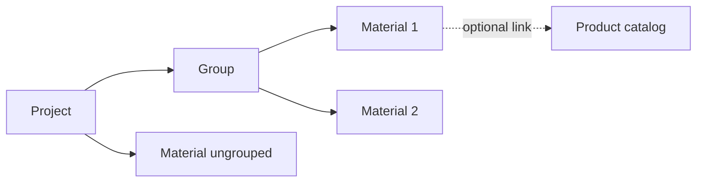

# Materials — Business Logic

## Rules

### What is a Material?
- A non-human resource used in a project (projects-v2)
- Examples: equipment, licenses, printed materials, external services
- Lives under `projects-v2/materials.*` endpoints

### Required Fields (Create)
- `project_id` — must belong to a project
- `title` — material name

### Project Hierarchy
- Material belongs to a `project`
- Optionally placed in a `group` (project group) via `group_id`
- Ordering: `after_id` controls position (`null` = top, omit = bottom)

### Status Model
- `to_do` | `in_progress` | `on_hold` | `done`
- Set via `update` — no separate status transition endpoints

### Billing
- `billing_method`:
  - `fixed_price` — flat fee for the material
  - `unit_price` — price per unit (quantity-based)
  - `non_billable` — not charged to customer
- `billing_status`: tracks whether the material has been invoiced

### Pricing Fields
- `unit_price` — price per unit `{ amount, currency }`
- `unit_cost` — internal cost per unit `{ amount, currency }`
- `fixed_price` — flat price (when billing_method = fixed_price)
- `price` — calculated total price (read-only on info)
- `cost` — calculated total cost (read-only on info)
- `margin` / `margin_percentage` — profit margin (read-only)

### Budget Tracking
- `external_budget` — client-facing budget
- `external_budget_spent` — how much of external budget used (read-only)
- `internal_budget` — internal cost budget

### Quantities
- `quantity` — actual quantity used
- `quantity_estimated` — estimated quantity (for planning)

### Assignees
- Assign users or teams: `{ type: "user"|"team", id }`
- Multiple assignees possible
- Separate `assign` / `unassign` endpoints (not via update)

### Product Link
- Optional `product_id` — references a catalog product
- Informational link — does NOT auto-inherit pricing
- Material maintains its own pricing independently

### Duplicate
- `materials.duplicate` creates a copy with same properties
- Takes `origin_id` — returns new material ID
- Copy stays in the same project

### Nullable Fields on Update
- Most fields accept `null` to clear: `description`, `quantity`, `quantity_estimated`, `unit_price`, `unit_cost`, `unit_id`, `fixed_price`, `external_budget`, `internal_budget`, `start_date`, `end_date`, `product_id`

### Material vs Product
- **Material** = project-specific resource with budgets, assignees, dates
- **Product** = reusable catalog item
- A material CAN reference a product, but has its own pricing and lifecycle
- Products can exist without materials; materials can exist without products

## Workflow

### Project Context

## Decisions

| Date | Decision | Reason |
|------|----------|--------|
| 2026-03-05 | Assign/unassign as separate tools | API design — not part of update endpoint |
| 2026-03-05 | Product link is informational only | Material pricing is independent — no auto-sync from product |
| 2026-03-05 | Duplicate documented as same-project copy | API behavior — cannot duplicate across projects |
| 2026-03-05 | Status changes via update, not lifecycle endpoints | Unlike tasks, materials have no `complete`/`reopen` — just set status field |
