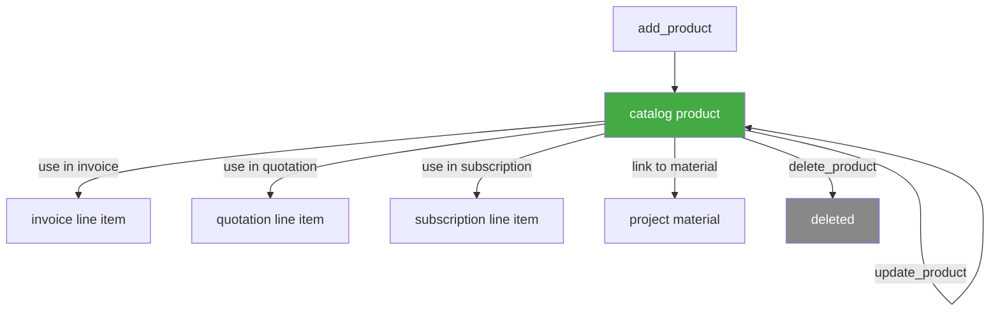

# Products — Business Logic

## Rules

### What is a Product?
- A catalog item that can be referenced in invoices, quotations, subscriptions, and materials
- Defines standard pricing, tax, and unit of measure
- Identified by `name` and/or `code` (at least one required)

### Required Fields (Create)
- Either `name` or `code` (or both) — at least one is mandatory

### Pricing Model
- **Purchase price**: `{ amount, currency }` — cost price (internal)
- **Selling price**: `{ amount, currency }` — standard selling price
- **Price list prices**: array of `{ price_list_id, price: { amount, currency } }` — customer-specific or tiered pricing
- All prices are separate from tax — tax is a reference to a `tax_rate_id`

### Category
- Optional `product_category_id` — lookup via `productCategories.list`
- Categories are per department (filter by `department_id`)
- Flat list (no hierarchy)

### Stock Management
- Optional feature (requires Teamleader stock management)
- `stock.amount` — current stock level
- `configuration.stock_threshold` — alert when stock drops below minimum:
  - `{ minimum: N, action: "notify" }`
  - Set to `null` to disable threshold

### Unit of Measure
- Optional `unit_of_measure_id` — lookup via `unitsOfMeasure.list`
- Examples: piece, hour, kg, meter

### Tax
- Optional `tax_rate_id` — default tax rate for this product
- When product is used in a line item, tax can be overridden per line

### Custom Fields
- Array of `{ id, value }` — custom field definition IDs
- Flexible key-value storage for business-specific attributes

### Nullable Fields on Update
- `name`, `code`, `description`, `unit_of_measure_id` accept `null` to clear
- Prices cannot be nulled — omit to leave unchanged

### Product vs Material
- **Product** = catalog item (reusable template, not project-specific)
- **Material** = project resource (linked to a project, has project-specific pricing/budgets)
- A material can reference a `product_id` to inherit defaults
- Products exist independently of projects; materials only exist within projects

## Workflow

## Decisions

| Date | Decision | Reason |
|------|----------|--------|
| 2026-03-05 | `name` or `code` required (not both) | API allows either — code-only products for ERP integration |
| 2026-03-05 | Stock management documented as optional feature | Not all Teamleader plans include it — avoids confusion |
| 2026-03-05 | Product vs material distinction documented | Common source of confusion — products are catalog, materials are project-specific |
| 2026-03-05 | Price list prices as separate array | Supports multi-tier pricing without overcomplicating base price |
