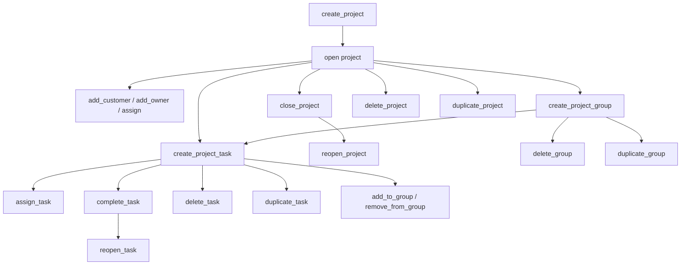

# Projects — Business Logic

## Rules

### API Version
- **Only projects-v2 API** — legacy `projects.*` and `milestones.*` are out of scope
- All endpoints prefixed with `projects-v2/`

### Hierarchy

```
Project
├── Group (phase)
│   ├── Task
│   └── Material
├── Task (ungrouped)
└── Material (ungrouped)
```

- **Project**: top-level container with customers, owners, assignees
- **Group** (phase): organizational unit within a project, has billing/budget
- **Task**: work item, belongs to a project and optionally a group
- **Material**: cost item, similar to task but no time tracking

### Project Lines
- `projectLines.list` returns ALL lines (tasks, materials, groups) for a project
- `project_id` must be **top-level** in request body — NOT inside `filter` (API quirk)
- `project_group_id` is NOT a server-side filter — filter client-side on `line.group?.id`
- `filter.types`: `["nextgenTask"]`, `["nextgenMaterial"]`, `["nextgenProjectGroup"]`
- `projectLines.addToGroup` / `projectLines.removeFromGroup` to move items between groups

### Date Fields
- Create/update: `start_date` / `end_date` (NOT `starts_on` / `due_on`)
- API response may return `starts_on` / `due_on` — but write operations use `start_date` / `end_date`

### Participant Roles
| Role | Meaning | API |
|------|---------|-----|
| **Customer** | company/contact the project is for | `projects.addCustomer` / `removeCustomer` — nested `{ type, id }` |
| **Owner** | user responsible for the project | `projects.addOwner` / `removeOwner` — flat `user_id` |
| **Assignee** | user or team doing the work | `projects.assign` / `unassign` — nested `{ type: "user"\|"team", id }` |

- Customers, owners, assignees are managed separately from project create/update
- Projects support multiple customers, owners, and assignees

### Close vs Delete

#### Close (`projects.close`)
- Sets status to closed
- **Requires** `closing_strategy`:
  - `mark_tasks_and_materials_as_done` — marks all open tasks/materials as done
  - `none` — leaves tasks as-is
- Reversible via `projects.reopen`

#### Delete (`projects.delete`)
- **Irreversible**
- **Requires** `delete_strategy`:
  - `unlink_tasks_and_time_trackings` — keeps tasks + time entries, unlinks from project
  - `delete_tasks_and_time_trackings` — deletes everything
  - `delete_tasks_unlink_time_trackings` — deletes tasks, keeps time entries

### Project Groups (Phases)

#### Create
- Uses `projectGroups.create` (NOT `projectLines.create` — does not exist)
- Required: `project_id`, `title`
- Date fields: `start_date` / `end_date`
- Optional: `color`, `billing_method`, budgets, assignees

#### Update
- Date fields: `start_date` / `end_date` (NOT `starts_on` / `due_on`)
- `billing_method`: nested `{ value, update_strategy: "none"|"cascade" }`
- `cascade` propagates billing method to child tasks

#### Delete
- **Requires** `delete_strategy`:
  - `ungroup_tasks_and_materials` — moves items to project root
  - `delete_tasks_and_materials` — deletes all items in the group

### Project Tasks

#### Create
- Uses `tasks.create` endpoint (NOT `projectLines.create`)
- `group_id` field (NOT `project_group_id`)
- `assignees: [{ type: "user"|"team", id }]` array (NOT flat `assignee_id`)
- Billing methods: `user_rate`, `work_type_rate`, `custom_rate`, `fixed_price`, `parent_fixed_price`, `non_billable`

#### Status Model
- `to_do` → `in_progress` → `on_hold` → `done`
- `tasks.complete` sets status to `done`
- `tasks.reopen` sets status back to `to_do`
- Status is NOT a server-side filter — filter client-side after fetch

#### Delete
- **Requires** `delete_strategy`:
  - `unlink_time_tracking` — keeps time entries
  - `delete_time_tracking` — removes time entries

### Duplicate Operations
- `projects.duplicate` — full project copy (groups, tasks, structure)
- `projectGroups.duplicate` — group copy without time trackings
- `tasks.duplicate` — task copy without time trackings

### Filters (List Projects)
- `term`: search text
- `status`: `open`, `planned`, `running`, `overdue`, `over_budget`, `closed`
- `customers`: array of `{ type, id }` — NOT flat `company_id`

## Workflow



## Decisions

| Decision | Choice | Reason |
|----------|--------|--------|
| API version | projects-v2 only | Legacy `projects.*` deprecated |
| projectLines.list quirk | `project_id` top-level | API design, NOT inside filter |
| Group create endpoint | `projectGroups.create` | `projectLines.create` does not exist |
| Task create field | `group_id` | NOT `project_group_id` |
| Assignee format | Array of `{type, id}` | NOT flat `assignee_id` |
| Strategy params required | Always send with close/delete | API returns error without them |
| Client-side status filter | Post-fetch filter | API doesn't support status filter for tasks |
