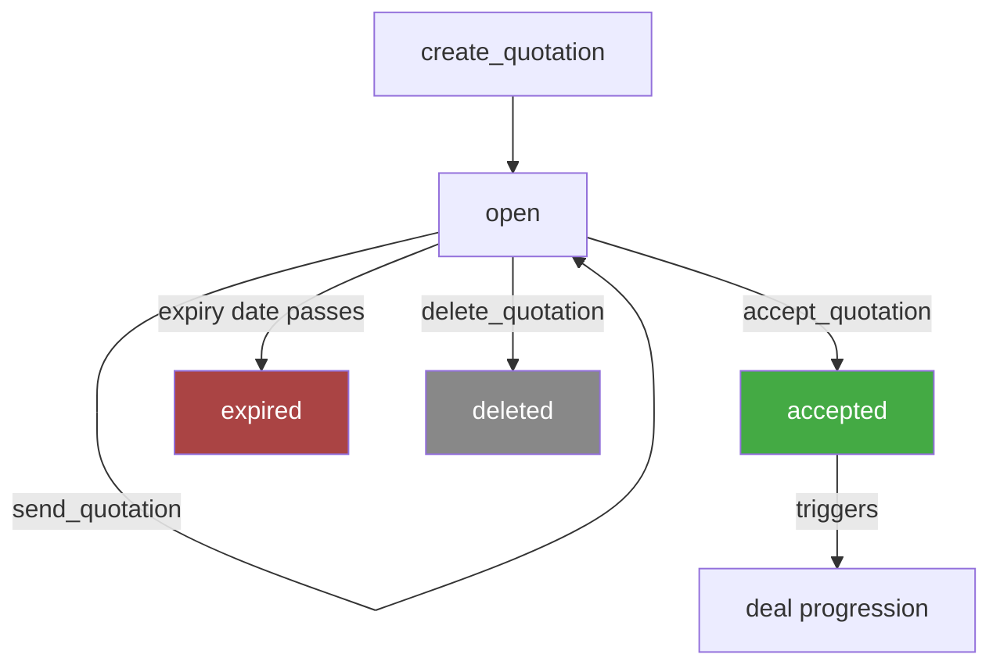
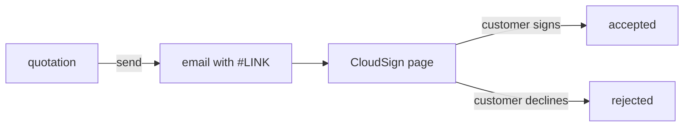

# Quotations — Business Logic

## Rules

### What is a Quotation?
- A price proposal linked to a deal
- Can contain grouped line items with section titles and/or free text
- Sent via email with CloudSign URL for digital acceptance

### Status Model
- **open** — created, not yet acted upon
- **accepted** — customer accepted the quotation
- **expired** — past expiry date (if configured)
- **rejected** — customer rejected
- **closed** — manually closed

### Required Fields (Create)
- `deal_id` — every quotation belongs to a deal
- At least one of: `grouped_lines` or `text` (or both)

### Line Items (Grouped Lines)
- Structured as `grouped_lines[]` — each group can have a `section.title`
- Sections allow visual grouping on the PDF (e.g., "Phase 1", "Phase 2")
- Each line item: `quantity`, `description`, `unit_price`, `tax_rate_id`
- `unit_price.tax = "excluding"` — string label, not currency
- Optional per line: `extended_description` (Markdown), `product_id`, `discount`, `purchase_price`, `periodicity`
- Periodicity on line items: `{ unit: "week"|"month"|"year", period: N }` — for recurring items

### Discounts
- Quotation-level discounts (not per line): `{ type: "percentage", value: N, description? }`
- Applied after all line item totals

### Expiry
- Optional expiry date + action: `{ expires_after: "YYYY-MM-DD", action_after_expiry: "lock"|"none" }`
- `lock` = customer can no longer accept after expiry
- `none` = expiry is informational only
- Requires feature access ("quotation expiry")

### Sending
- `quotations.send` — sends one or more quotations (must be from the same deal)
- Requires: sender (`user` or `department`), recipients (to, optional cc/bcc), subject, content, language
- Use `#LINK` in content body to insert the CloudSign URL
- Supports file attachments

### Accept
- `quotations.accept` — marks as accepted
- Typically triggers deal progression

### Download
- PDF format only
- Returns temporary URL with expiration

### Delete
- Irreversible — no undo

### Filters (List)
- Only supports `ids` filter (no customer/deal/status filter on list endpoint)
- To find quotations for a deal: use `get_deal` → quotation references, or list + filter client-side

## Workflow

### Send Flow

## Decisions

| Date | Decision | Reason |
|------|----------|--------|
| 2026-03-05 | `deal_id` required on create | API requirement — quotations always belong to a deal |
| 2026-03-05 | Section titles as `grouped_lines[].section_title` | Flattened from API's `section.title` nesting for simpler params |
| 2026-03-05 | `#LINK` placeholder documented for send | Non-obvious — required for CloudSign integration |
| 2026-03-05 | Multiple quotations per send call | API supports batch send for same deal — all or nothing |
| 2026-03-05 | List filter only supports `ids` | API limitation — use deal info or get by ID for other queries |
