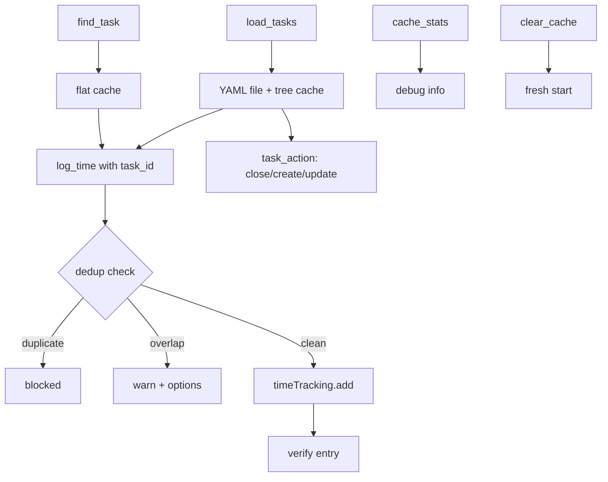

# Resolve (Smart Tools) — Business Logic

## Rules

### Overview
Smart tools that sit on top of the raw API tools. Cache-first, numbered selection, dedup protection.

### Tools

| Tool | Purpose |
|------|---------|
| `find_task` | Interactive company → project → group → task resolution with cache |
| `log_time` | Register time with dedup, overlap check, cache resolution |
| `load_tasks` | Full project tree → YAML file with all IDs |
| `task_action` | Maintenance: close, create, update, move_time, delete_group, move_to_group |
| `cache_stats` | Debug: show cache entry counts and cached tasks |
| `clear_cache` | Reset `~/.teamleader-cache.json` (forces fresh API lookups) |

### Startup Initialization
- Auto-runs on server start (before any tool call)
- Loads: active user (`users.me`), work types (`workTypes.list`), default work type (most-used from last 7 days)
- All cached persistently — no expiry for user/work types

### Cache-First Strategy
1. Check flat task cache (`findTask`) — sorted by `last_used`
2. Check task tree cache (`scoreTasksInTree`) — keyword scoring
3. API call if both miss
4. Cache result on hit

### find_task: Interactive Resolution

```
company_name → companies.list (cache-first)
    │
    ├── 0 results → error
    ├── 1 result → auto-proceed
    └── N results → numbered list
         │
group_name → search across ALL projects for the company
    │
    ├── found in 1 project → auto-proceed
    ├── found in N projects → ask project_selection=N
    └── not found → ask confirm_create_group + project_selection
         │
task_name → projectLines.list + tasks.list (client-side group filter)
    │
    ├── 1 match → auto-select
    ├── N matches → ask task_selection=N
    ├── 0 matches + other tasks exist → ask confirm_create_task
    └── 0 matches + empty group → auto-create task
```

- Company: never auto-created (error if not found)
- Project: not auto-created (requires `confirm_create_project` + `project_name`)
- Group: not auto-created (requires `confirm_create_group` + `project_selection`)
- Task: auto-created only if group is empty; otherwise asks confirmation
- `_company_id`, `_project_id`, `_group_id`: internal state params passed between calls

### load_tasks: Full Tree + YAML

- Builds: `company → projects → groups → tasks` tree
- Cache: 30 min TTL (`task_trees` in cache)
- Writes YAML to `~/.teamleader-tasks-{slug}.yaml` with all IDs
- Excludes cancelled projects
- `only_open=true` (default): filters to `to_do`, `in_progress`, `on_hold`
- `visual=true`: ASCII tree with numbered tasks and status icons
  - `o` = to_do, `>` = in_progress, `||` = on_hold, `x` = done, `-` = cancelled
- `task_selection=N`: caches a specific task for use in `log_time`
- `force_refresh=true`: bypasses 30min cache

### log_time: Time Registration

#### Resolution Order
1. `task_id` param → skip cache, build from tree metadata
2. Flat cache `findTask(company, task_name)` → direct hit
3. Tree scoring `scoreTasksInTree` → fuzzy match, confirm with `confirm_task_match=N`
4. `searchTasks` suggestions → hint to user
5. Not found → ask user to run `find_task` first

#### Time Parsing
- ISO 8601: used as-is
- `YYYY-MM-DD HH:MM`: converted to `YYYY-MM-DDTHH:MM:00+01:00`
- `HH:MM`: combined with `date` param (default: today)

#### Deduplication
- Fetches existing entries for +-24h window around new entry
- **Exact duplicate**: same start time to second precision → blocked
  - NOTE: matches on start time, NOT task ID (subject IDs differ between todo and nextgenTask)
- **Overlap**: new entry overlaps with existing → warning with options:
  - `confirm_overlap=true` → register anyway (parallel tasks)
  - Adjust existing via `update_timetracking`
  - `force=true` → skip all dedup checks
- Verification: after add, reads entry back via `timeTracking.info` to confirm

### task_action: Maintenance

| Action | Required Params | Notes |
|--------|----------------|-------|
| `close` | `task_id` or `task_number` | Sets status to `done`, removes from tree cache |
| `create` | `project_id`, `task_title` | Optional: `group_id`, `description`. Invalidates tree cache |
| `update` | `task_id` or `task_number` | Optional: `task_title`, `description` |
| `move_time` | `time_entry_id` + `new_task_id`/`new_task_number` | Deletes old entry, creates new on target task |
| `delete_group` | `group_id` | Strategy: `ungroup_tasks_and_materials`. Invalidates tree cache |
| `move_to_group` | `task_id`/`task_number` + `group_id` | Uses `projectLines.addToGroup`. Invalidates tree cache |

- `task_number` resolves from visual tree (1-based, open tasks only)
- All IDs should come from YAML file written by `load_tasks`
- **Never guess a task_id** — invalid IDs return 400, not 404

### Task Tree Scoring (`scoreTasksInTree`)

| Match Location | Score per Word |
|----------------|---------------|
| Task title | 3 points |
| Group name | 1 point |
| Project name | 0.5 points |

- Words shorter than 3 characters are ignored
- Results sorted by score descending
- Used as fallback when flat cache misses

## Workflow



## Decisions

| Decision | Choice | Reason |
|----------|--------|--------|
| Preferred flow | `load_tasks` → `log_time(task_id=...)` | Fastest, fewest steps |
| Dedup match | Start time to second precision | Subject IDs differ between todo/nextgenTask |
| Tree output | YAML file, not MCP response | Protect context window from large trees |
| Task creation | Auto-create only in empty groups | Prevent accidental duplicates |
| move_time | Delete + re-create | No API endpoint to change subject on existing entry |
| Default only_open | `true` | Most common use case — hide completed tasks |
| Scoring fallback | 3/1/0.5 point weights | Task title most specific, project least |
