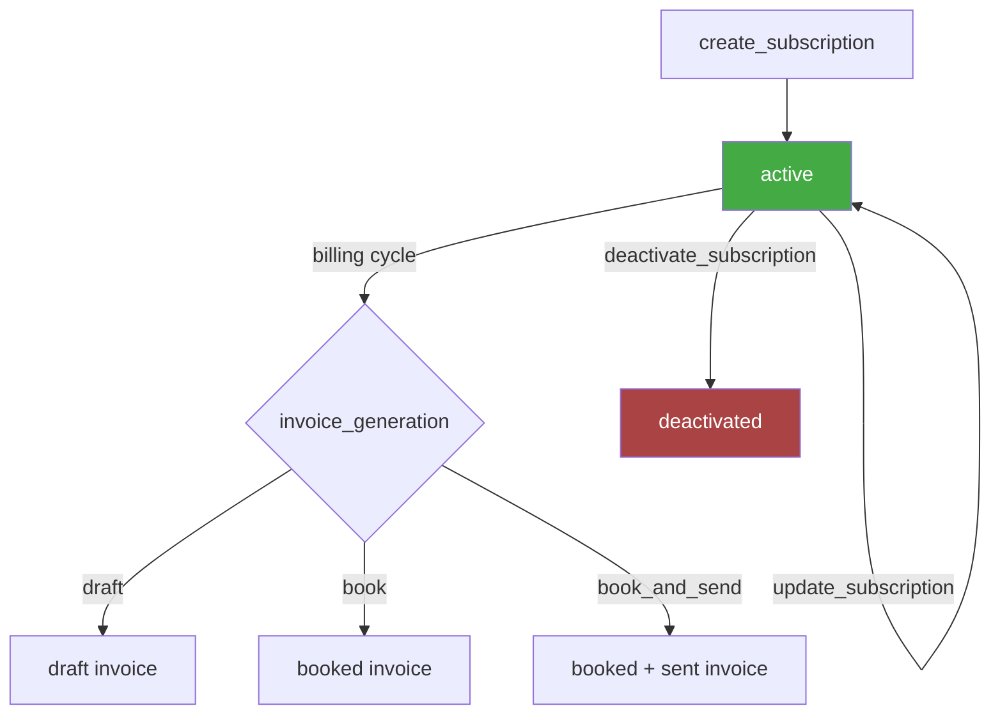
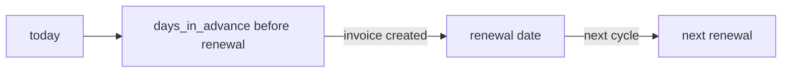

# Subscriptions — Business Logic

## Rules

### What is a Subscription?
- A recurring invoice template that automatically generates invoices on a schedule
- Each subscription has a billing cycle, line items, and an invoice generation strategy

### Status Model
- **active** — generating invoices on schedule
- **deactivated** — stopped, no more invoices generated
- No `delete` — subscriptions can only be deactivated, not removed
- Deactivated subscriptions remain visible for historical reference

### Required Fields (Create)
- `title` — subscription name
- `invoicee.customer` — nested `{ type, id }` (tool flattens to `customer_type` + `customer_id`)
- `department_id` — issuing department
- `starts_on` — start date (YYYY-MM-DD)
- `billing_cycle` — defines the schedule:
  - `periodicity.unit`: `week` | `month` | `year`
  - `periodicity.period`: number (e.g., 3 = quarterly when unit=month)
  - `days_in_advance`: how many days before renewal the invoice is created
- `payment_term` — `{ type, days? }`
- `invoice_generation` — **required**, controls what happens when invoice is generated:
  - `draft` — create as draft (manual review)
  - `book` — auto-book (assign number)
  - `book_and_send` — auto-book + auto-send (requires `mail_template_id`)
- `grouped_lines` — at least one line item group

### Billing Cycle Examples

| Schedule | unit | period | days_in_advance |
|----------|------|--------|-----------------|
| Monthly | month | 1 | 28 |
| Quarterly | month | 3 | 28 |
| Yearly | year | 1 | 30 |
| Bi-weekly | week | 2 | 7 |

### Line Items
- Same `grouped_lines` structure as invoices
- `unit_price.tax = "excluding"` — string label, not currency
- Optional `product_id` per line item

### Update
- Partial updates supported — only send changed fields
- `billing_cycle` can be partially updated (just `days_in_advance`, or just `periodicity`)
- `note` set to empty string → becomes `null`
- `ends_on` can be set to limit subscription duration

### Filters (List)
- Customer: nested `{ type, id }`
- Status: `["active"]`, `["deactivated"]`, or both
- Cross-references: `invoice_id` (find subscription that generated an invoice), `deal_id`
- Sort: `title`, `created_at`, `status`

## Workflow

### Renewal Timeline

## Decisions

| Date | Decision | Reason |
|------|----------|--------|
| 2026-03-03 | `invoice_generation` required on create | Critical field — determines automation level, no safe default |
| 2026-03-03 | No delete tool — only deactivate | API design — subscriptions are historical records |
| 2026-03-05 | `billing_cycle` documented with examples table | Complex nested structure, easy to get wrong |
| 2026-03-05 | `book_and_send` requires `mail_template_id` noted | Silently fails without it |
