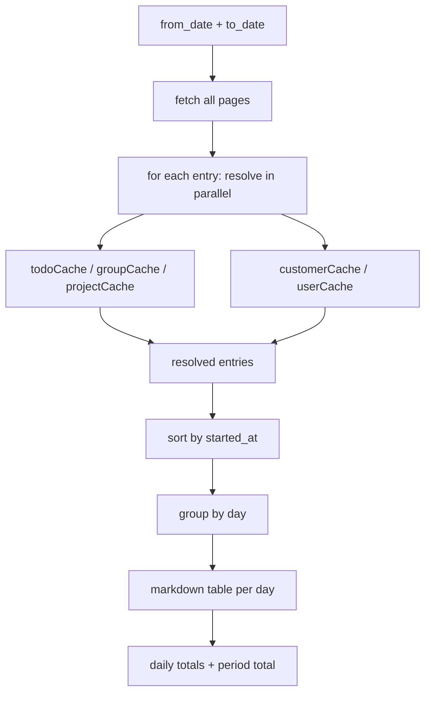

# Timesheet — Business Logic

## Rules

### Overview
- Day-by-day overview of time tracking entries with fully resolved context
- Resolves: subject → task title, group title, project title, client name, user name
- Output: markdown table per day + daily totals + period total
- Recommended max: 2 weeks per call (resolve chain = many API calls)

### Date Handling
- Input: `from_date` / `to_date` as `YYYY-MM-DD` (inclusive)
- Converted via `toDate()` helper:
  - `from_date` → `YYYY-MM-DDT00:00:00+00:00`
  - `to_date` → `YYYY-MM-DDT23:59:59+00:00`
- Sort: `starts_on` ascending
- Pagination: fetches all pages (100 per page) until exhausted
- Uses `includes: "relates_to"` to get linked entities per entry

### Resolve Chain

```
subject (todo) → tasks.info → task title + customer + project ref
                                │
relates_to (nextgenProjectGroup) → projectGroups.info → group title
                                │
relates_to (nextgenProject) → projects.info → project title + customers[]
                                                │
                                    customers[0] → contacts.info / companies.info → client name
                                │
entry.user.id → users.info → user name
```

### In-Request Caching
- 5 separate `Map` caches per request (not persisted between calls):
  - `todoCache`: todo ID → `{ title, customer?, project? }`
  - `groupCache`: group ID → title
  - `projectCache`: project ID → `{ title, customers[] }`
  - `customerCache`: `type:id` → name
  - `userCache`: user ID → name
- Prevents duplicate API calls within the same timesheet request
- All resolves run via `Promise.all` for parallel execution

### Resolve Fallback Strategy
1. **Primary**: `relates_to` from `includes` — `nextgenProjectGroup`, `nextgenProject`, `company`, `contact`
2. **Fallback**: standalone task's `.customer` and `.project` fields (from `tasks.info`)
3. **Last resort**: `"?"` on failed resolve, `"type:id"` on unknown subject type
4. Non-todo subjects: displayed as `type:shortId` (e.g., `meeting:a1b2c3d4`, `milestone:e5f6g7h8`)

### Output Format
- Grouped by day (YYYY-MM-DD header)
- Columns: Start | End | Dur | Description | Task | Group | Project | Client | User
- Time format: `HH:MM` (extracted from ISO string)
- Duration format: `H:MM` (converted from seconds)
- Daily total: bold at bottom of each day table
- Period total: bold at very end

## Workflow



## Decisions

| Decision | Choice | Reason |
|----------|--------|--------|
| In-request cache only | Not persisted | Data is context-specific, short-lived |
| Parallel resolve | `Promise.all` over all entries | Performance — many API calls per entry |
| Fallback on error | `"?"` string | Never crash the whole timesheet for one failed resolve |
| Max period | ~2 weeks recommended | Resolve chain makes N API calls per entry |
| relates_to primary | Over subject-only resolve | More reliable for nextgen projects |
| Totals in Dutch | `Totaal` label | User-facing output, matches Teamleader locale |
