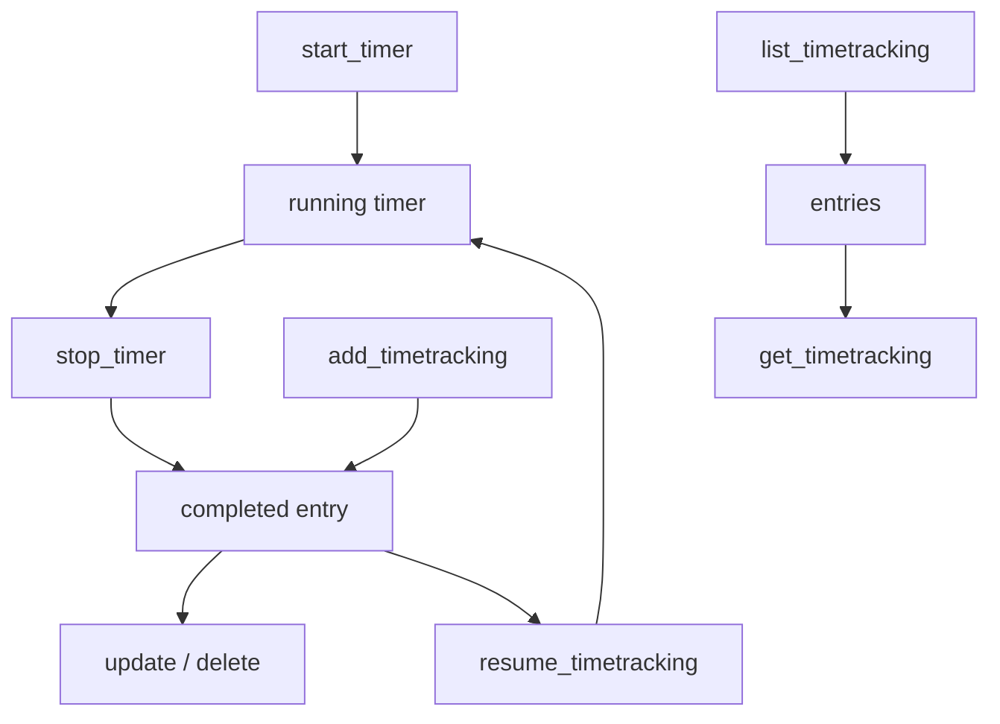

# Time Tracking — Business Logic

## Rules

### Timer vs Time Tracking
- **Timer** (`timers.*`): real-time stopwatch — start, stop, get current, update
  - Only one timer per user at any time
  - Starting a new timer does NOT auto-stop the previous one — stop first
  - `timers.stop` takes NO parameters — always stops the authenticated user's active timer
  - Stopping converts the timer into a completed time tracking entry
- **Time Tracking** (`timeTracking.*`): completed entries with start + end (or duration)
  - `timeTracking.add` / `.update` / `.delete` / `.list` / `.info`
  - `timeTracking.resume` starts a new timer from an existing entry (copies subject + work type)

### Subject Types
- List filter: `company`, `contact`, `event`, `todo`, `milestone`, `ticket`
- Add/update: `company`, `contact`, `event`, `milestone`, `nextgenTask`, `ticket`, `todo`
- **`nextgenTask`** = project task (projects-v2 API) — use this for project time logging
- **`todo`** = standalone task (tasks API)
- API returns `subject.type: "todo"` even for nextgen tasks in `timeTracking.list` — IDs differ

### Date Filter Conversion (`toDate` helper)
- Input: bare `YYYY-MM-DD` string
- `started_after` / `ended_after` → `YYYY-MM-DDT00:00:00+00:00` (start of day)
- `started_before` / `ended_before` → `YYYY-MM-DDT23:59:59+00:00` (end of day)
- API requires full ISO 8601 datetime — bare dates cause 400

### Add: Duration vs End Time
- Provide `ended_on` (datetime) OR `duration` (seconds) — not both
- Never include milliseconds in datetime — causes dedup mismatches

### Update
- API uses `started_at` + `duration` (seconds), NOT `ended_at`
- Partial updates work for non-time fields (description, work_type, subject)
- For time fields: always send `started_at` + `duration` together

### Resume
- Creates a new timer from an existing entry
- Copies subject and work type
- Any running timer is stopped first (auto-stop on resume)

## Workflow

## Decisions

| Decision | Choice | Reason |
|----------|--------|--------|
| Timer endpoint | `timers.*` NOT `timeTracking.start/stop` | Those don't exist |
| Date filter input | YYYY-MM-DD auto-converted | Simplify caller, avoid 400 errors |
| Milliseconds stripped | `toFilterDate()` helper | Dedup matches on second precision |
| Subject type for projects | `nextgenTask` | Maps to projects-v2 task IDs |
| Duration format | Seconds (integer) | API expects seconds, not HH:MM |
